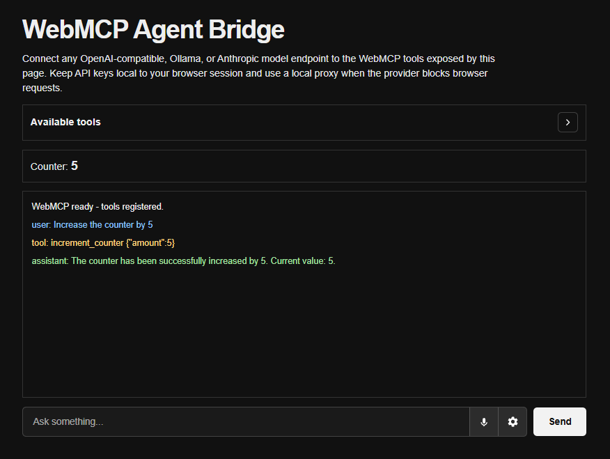

# Local Ollama WebMCP Chat



A lightweight browser-based chat app that connects to a local Ollama server and exposes simple WebMCP tools for an AI agent to call.

## Features

- Local Ollama chat interface
- WebMCP tool registration for browser actions
- Counter demo tools to increment or decrement a value
- Voice input support in supported browsers
- Model selector loaded from the local Ollama API

## Requirements

- Ollama installed and running locally
- More info at [https://ollama.com](https://ollama.com)

## Run the app

From the project folder, serve it locally with:

```bash
npx serve .
```

Then visit:

```text
http://localhost:3000
```

## Notes

- The app expects Ollama at `http://localhost:11434/api/chat`.
- The model used in my testing is `qwen3:4b`.
- Voice input uses the browser Web Speech API and works best in Chrome or Edge.
- WebMCP support depends on the browser environment and the available WebMCP implementation.
